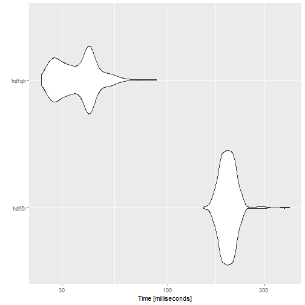
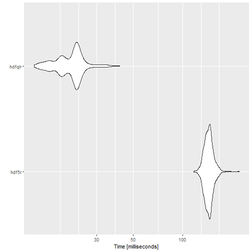

This document provides some benchmarks for comparing the performance
of hdfqlr to two other HDF file APIs available in R: The 
[`hdf5r`](https://cran.r-project.org/package=hdf5r) package 
and the now-deprecated
[`h5`](https://cran.r-project.org/package=h5) package. 
Other packages that provide read (but not write) support for HDF files
were not tested.


```r
library(hdfqlr)
library(hdf5r)
library(h5)
library(microbenchmark)
```


## Writing HDF datasets


```r
write_hdfqlr = function() {
	test.file = tempfile(fileext = ".h5")
	hql_create_file(test.file)
	hql_use_file(test.file)
	for (i in paste0("vector", 1:6)) {
		write("DATASET", runif(10000), i)
	}
	hql_close_file(test.file)
}

write_hdf5r = function() {
	test.file = tempfile(fileext = ".h5")
	# create hdf5 file (6 vectors with 10k random numbers each)
	h5file = hdf5r::H5File$new(test.file, "w")
	for (i in paste0("vector", 1:6)) {
		h5file[[i]] = runif(10000)
	}
	h5file$close_all()
}

write_h5 = function() {
	test.file = tempfile(fileext = ".h5")
	f = h5::h5file(test.file)
	for (i in paste0("vector", 1:6)) {
		f[i] = runif(10000)
	}
	h5::h5close(f)
}

write.benchmark = microbenchmark(
		"hdf5r" = write_hdf5r(),
		"h5" = write_h5(),
		"hdfqlr" = write_hdfqlr(),
	times = 1000L,
	unit = 'ms'
)
```


|expr   |       min|        lq|      mean|    median|        uq|      max| neval|
|:------|---------:|---------:|---------:|---------:|---------:|--------:|-----:|
|hdf5r  | 137.01529| 142.83631| 149.75298| 146.79678| 151.55699| 460.1412|  1000|
|h5     |  27.72461|  29.08571|  30.89929|  29.85698|  31.29489| 156.5213|  1000|
|hdfqlr |  26.27676|  27.78007|  29.81201|  28.59322|  30.40774| 139.9679|  1000|




## Reading HDF datasets


```r
tf = tempfile(fileext = ".h5")
hql_create_file(tf)
hql_use_file(tf)
sets = paste0("vector", 1:6)
for (i in sets) {
	hql_write_dataset(runif(10000), i)
}
hql_close_file(tf)

read_hdfqlr = function(file, sets) {
	hql_use_file(file)
	result = lapply(sets, hql_read_dataset)
	hql_close_file(file)
	result
}

read_hdf5r = function(file, sets) {
	h5file = hdf5r::H5File$new(file, "r")
	result = lapply(sets, function(i) h5file[[i]][])
	h5file$close_all()
	result
}

read_h5 = function(file, sets) {
	h5file = h5::h5file(file, "r")
	result = lapply(sets, function(i) h5file[i][])
	h5::h5close(h5file)
	result
}

read.benchmark = microbenchmark(
	"hdf5r" = read_hdf5r(tf, sets),
	"h5" = read_h5(tf, sets),
	"hdfqlr" = read_hdfqlr(tf, sets),
	times = 1000L,
	unit = 'ms'
)
```


|expr   |        min|        lq|       mean|     median|         uq|       max| neval|
|:------|----------:|---------:|----------:|----------:|----------:|---------:|-----:|
|hdf5r  | 106.138066| 109.44580| 112.821884| 111.200560| 114.180845| 197.76754|  1000|
|h5     |   7.334914|   7.91498|   8.332634|   8.117439|   8.350525|  29.06353|  1000|
|hdfqlr |  13.928192|  14.95506|  15.652447|  15.264958|  15.749835|  55.47240|  1000|


